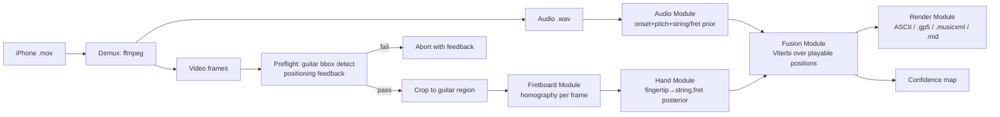
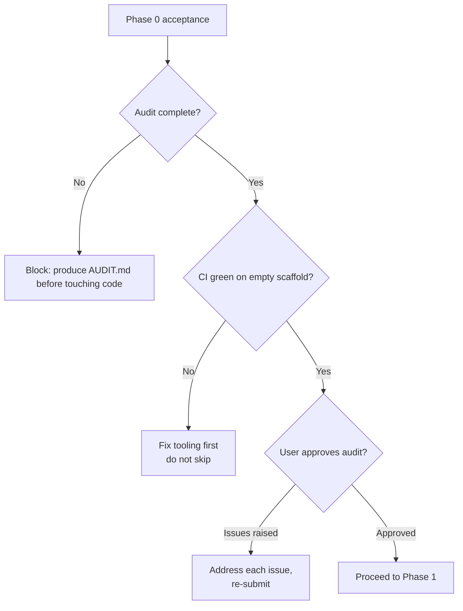
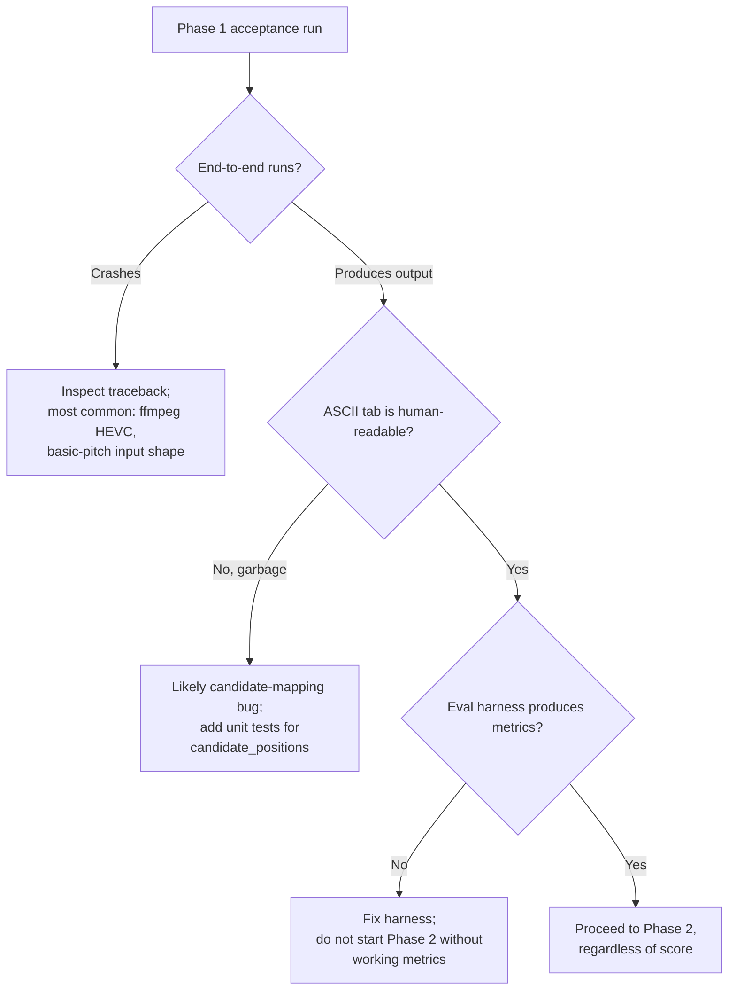
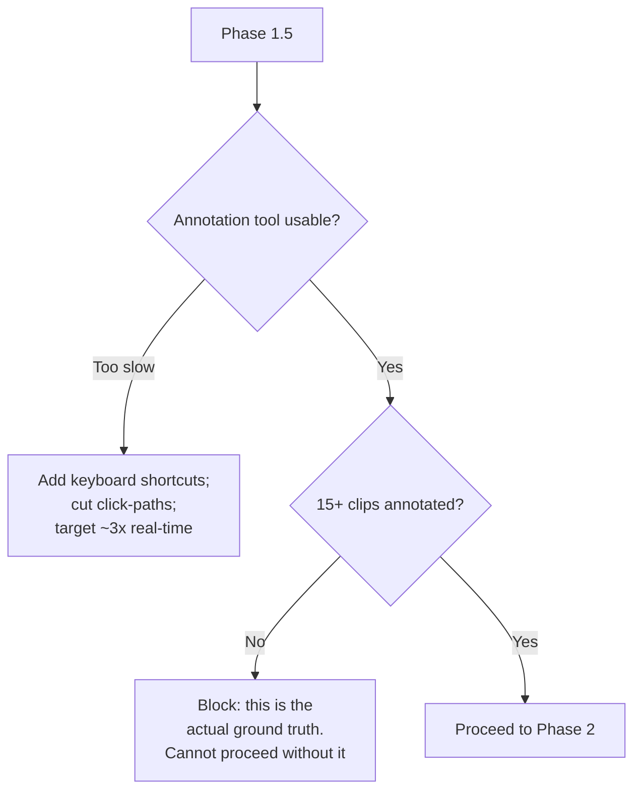
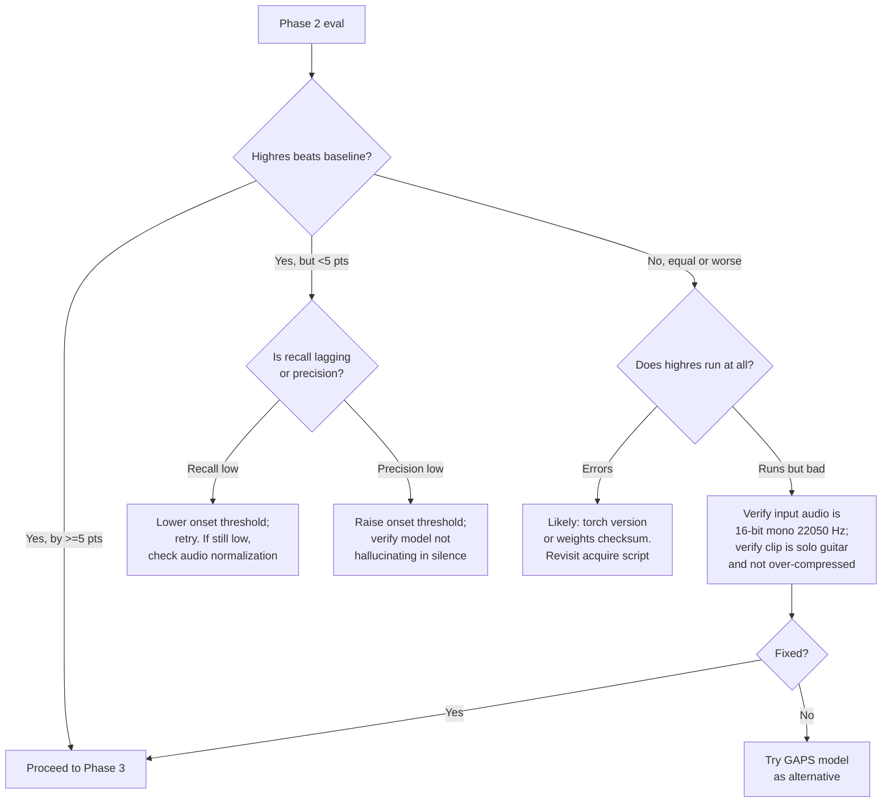
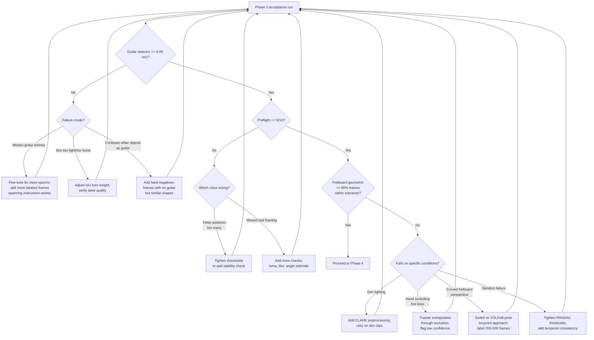
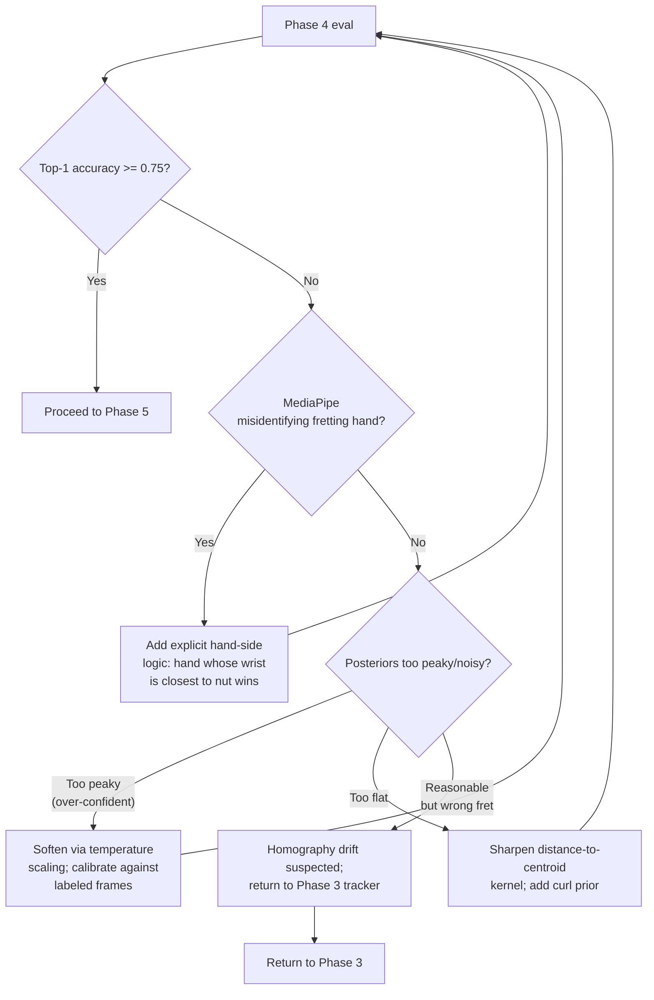
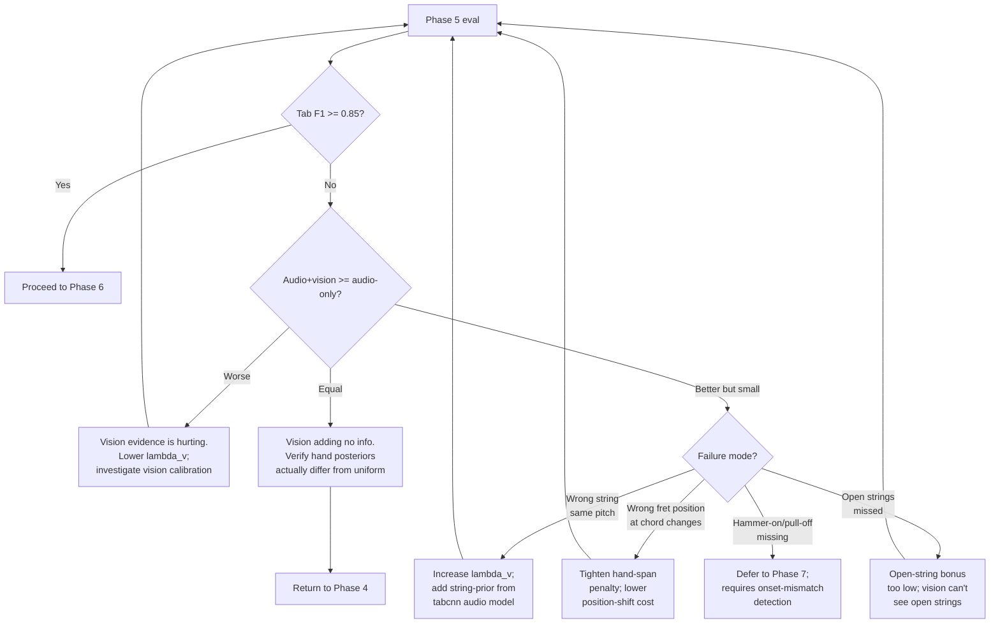
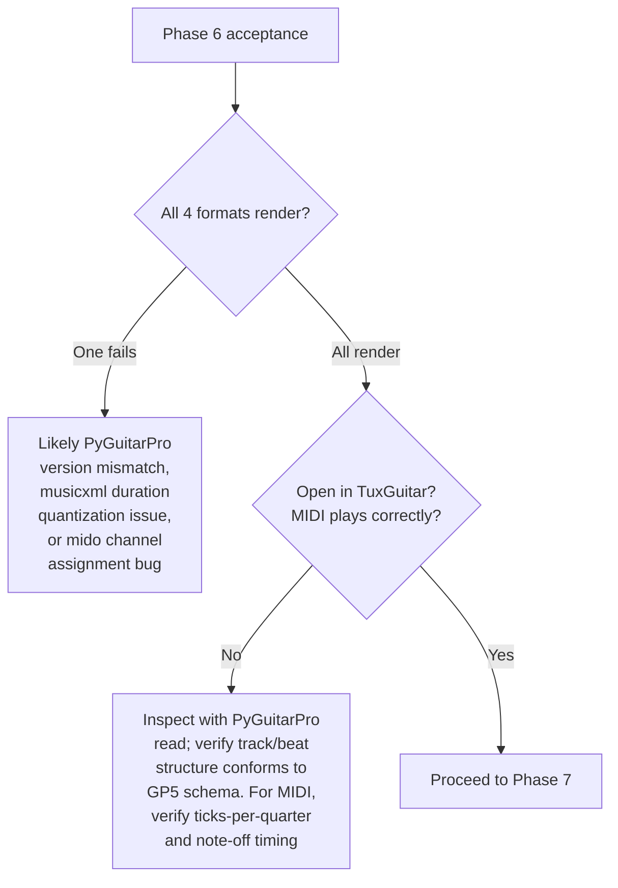

# Guitar Tab Pipeline — Refactoring & Build Specification

> **Project codename:** `tabvision` (rename freely)
> **Target user:** A solo guitarist filming themselves on an iPhone with the guitar resting on their lap, who wants accurate tablature output.
> **Document role:** Canonical project spec. Source of truth. Update this file when scope changes; never let drift accumulate silently in code.
> **Primary maintainer:** Pat
> **Spec version:** 1.0
> **Last updated:** 2026-05-04

---

## 2026-05-07 Scope Override: Manual Work Removed From v1 Gates

The original spec below remains historical context, but v1 release gates no
longer require manual annotation, new user recordings, manual dataset curation,
manual downloads, or user-corrected self-labeling. Those activities are
optional future validation work.

For v1, acceptance evidence must come from automated sources only:

- deterministic smoke evals and checked-in fixtures,
- public/programmatic datasets that can be acquired without manual steps,
- existing GuitarSet validation reports and other reproducible public-data
  reports,
- license, fresh-install, and renderer verification commands.

Manual Phase 1.5/3/4 gates are therefore `removed_from_v1` or
`optional_future`, not blockers. `--position-prior guitarset-v1` remains an
explicit option; `--position-prior none` remains the default unless automated
evidence justifies promotion later.

---

## 0. How to Use This Document (Claude Code Operating Manual)

You are Claude Code. This document is your source of truth. Operating rules:

1. **Audit before refactor.** Phase 0 is non-negotiable. Do not modify code before running the audit checklist in §2.1 and producing an `AUDIT.md` report at the repo root. Do not assume the existing code maps cleanly to this spec.
2. **One phase at a time.** Phases in §7 are ordered. Do not start Phase N+1 until Phase N's acceptance test passes (see §9.3) AND the user explicitly says "proceed". The decision tree at the end of each phase tells you what to do if the test fails.
3. **Interface contracts are immutable within a phase.** The dataclasses and function signatures in §8 are contracts. Implementations may change; signatures may not, except by explicit user approval and a corresponding update to this document.
4. **Tests over commits.** Every phase ships with new tests (see §9). A phase is not "done" until tests are green and the acceptance criterion is met on the eval set.
5. **Track decisions.** When you take a non-obvious branch in any decision tree, append an entry to `docs/DECISIONS.md` in this format:
   ```
   ## YYYY-MM-DD — <short title>
   **Phase:** <N>
   **Decision tree:** <tree name>
   **Branch taken:** <branch label>
   **Evidence:** <metric values, file paths>
   **Reasoning:** <one paragraph>
   ```
6. **Reach for free tools first.** Pretrained weights > fine-tuning > training from scratch. CPU-runnable > GPU-required. Local > Colab > Kaggle. See §6.
7. **Flag, don't hallucinate.** If a metric is borderline, output a low-confidence flag in the result, not a guess. The pipeline must produce calibrated confidences end-to-end.
8. **Stop and ask** when (a) the spec is genuinely ambiguous, (b) a phase test fails in a way the decision tree doesn't cover, or (c) you would otherwise add a dependency or training run that costs money.

### Quick orientation

- Skim §1 (aim & scope) and §3 (architecture).
- Read §2 (refactor strategy) and run the audit.
- Read §7 Phase 0 in full.
- Skim §8 (interfaces) so you know the contracts.
- Begin work.

---

## 1. Project Aim & Scope

### 1.1 Primary goal

Build a pipeline that ingests an iPhone video file (audio + video) of a single person playing a single guitar resting on their lap, and emits accurate guitar tablature.

**Accuracy is the dominant optimization target.** Latency, code elegance, and even feature breadth are subordinate to accuracy on the constrained scenario above.

### 1.2 In scope (v1)

- Single guitar, standard tuning (E A D G B E), capo position 0–7.
- Steel-string acoustic, classical, **and** electric guitar.
- Both **clean and distorted** tones (see §6.1 for fine-tuning data implications, §7 Phase 7 for the dedicated distorted-electric track).
- Both **fingerstyle and strummed** playing — the pipeline accepts a `--style` flag and adapts fusion behavior accordingly (chord-mode for strumming, single-line + chord-aware for fingerstyle, mixed default).
- One performer, single iPhone camera, single take. The camera need not be perfectly stationary, but the guitar must remain within a defined positioning region (see Phase 3 / preflight tool).
- Guitar resting on the player's lap or thigh; fretboard substantially visible from the body to at least the 12th fret.
- Right-handed players (left-handed support deferred — see §1.3).
- Output formats: ASCII tab, GuitarPro 5 (.gp5), MusicXML (.musicxml), and MIDI (.mid).
- Per-note confidence values surfaced in the output.
- A **preflight tool** that validates camera framing on a clip and emits actionable feedback ("move guitar left", "lighting too dim", "fretboard angle too oblique") before the user wastes a long take.
- CLI tool. No GUI in v1. Web UI deferred.
- Runs on a developer laptop (Linux/WSL or macOS). Inference must be CPU-feasible end-to-end; training may use GPU (cloud).

### 1.3 Out of scope (non-goals)

- Multi-instrument separation (drums, vocals, bass mixed in).
- Live / real-time transcription. Offline only.
- Effects beyond clean and standard distortion (no wah, octave, ring mod, extreme fuzz; clean and overdrive/distortion *are* in scope per §1.2).
- Alternate tunings beyond capo (drop D, DADGAD, open tunings) — phase 2 of the project, not this refactor.
- Left-handed players, slide guitar, fretless instruments, baritone/8-string guitars.
- Mobile app, web app, GUI, hosted service.
- Music typesetting beyond the supported export formats.
- Anything involving auth, payments, user accounts.

### 1.4 Success criteria

A reproducible eval harness (§9.2) reports the following on a held-out test set of the user's own playing (10+ clips, 30 s–3 min each, hand-annotated):

| Metric | Target | Definition |
|---|---|---|
| Note onset F1 (50 ms) | ≥ 0.92 | mir_eval `onset_f_measure` |
| Pitch F1 (50 ms, no offset) | ≥ 0.90 | mir_eval `note_f_measure` |
| Tab F1 (string + fret + onset) | ≥ 0.88 | Custom: TP iff string, fret, and onset all match within 50 ms |
| Chord-instance accuracy | ≥ 0.85 | % of strummed/arpeggiated chords whose entire fingering set is recovered |
| Median end-to-end latency for a 60 s clip on laptop CPU | ≤ 5 min | Wall-clock |

A "stretch" target adds expressive markings (bends, hammer-ons, pull-offs, slides) — out of scope for v1 acceptance, tracked for v1.1. **(D1-b BASELINED 2026-07-09 — the old "≥ 0.70 detection F1" is retired as unfounded; see `docs/EVAL_REPORTS/d1b_technique_baseline_2026-07-09.md`, `scripts/eval/d1b_technique_baseline.py`.) Measured facts: (a) the operational pipeline's technique-detection F1 is `0.00` — no detector is wired into the default `highres` path (it emits no `tags`); (b) GuitarSet has no discrete technique labels, so it can only *proxy*-baseline bends (~6% of notes) & slides (~3%) from `pitch_contour` — hammer-ons/pull-offs are articulation, not pitch, and are unmeasurable on GuitarSet (need a technique-labelled corpus → Guitar-TECHS, electric → v2); (c) even the proxy is a threshold-sensitive heuristic, not human annotation. Honest stretch, replacing 0.70: first milestone = build any bend/slide detector and beat `0.00`; do NOT set a numeric F1 target until a detector exists AND is scored against human technique labels (§0 rule 7).**

The targets above are aggregate over the full eval set. Per-difficulty-tier expectations:

| Tier | Tab F1 target |
|---|---|
| Clean acoustic single-line | ≥ 0.94 |
| Clean acoustic strummed | ≥ 0.86 |
| Clean electric | ≥ 0.90 |
| Distorted electric | ≥ 0.82 |

If the aggregate hits 0.88 but distorted electric scores below 0.75, treat that as a partial pass and prioritize Phase 7 distortion-augmented fine-tuning before final acceptance.

### 1.4.1 v1 acceptance — acoustic scope; electric deferred to v2 (2026-06-02)

This section **supersedes** the 2026-06-01 "highest targets including
electric" amendment. Per user direction (2026-06-02), **v1 is scoped to
acoustic guitar.** This is an **evidence-based** scope decision, not a
relaxation: electric was measured (see below) and found to be blocked on a
model that does not yet exist.

**v1 acceptance (honest audio-only targets, 2026-06-02).** Single-line is
**information-limited** from audio (the string/fret ambiguity — see below), so
targets are set to the demonstrated audio-only capability, not the original
0.94 / 0.86 (which become the **v1.1 video-assisted** reference):

| Tier | v1 acceptance | demonstrated (mean / lower-95) |
|---|---:|---:|
| Clean acoustic single-line | ≥ 0.45 | 0.523 / 0.457 |
| Clean acoustic strummed | ≥ 0.60 | 0.676 / 0.606 |
| Aggregate Tab F1 | ≥ 0.55 | 0.600 |

Plus Onset F1 ≥ 0.92, Pitch F1 ≥ 0.90, latency ≤ 5 min — all **over the
acoustic eval set** (GuitarSet held-out player 05). Acceptance test:
`lower_95_CI ≥ target` over clips (95 % bootstrap CIs). Personal clips remain
banned as a gate.

**v1 ACCEPTED — formal acceptance run 2026-06-03** (eval harness `292252d`,
GuitarSet player-05 validation, 60 clips, `--position-prior guitarset-v1`):
single-line Tab F1 0.523 (lo-95 0.457), strummed 0.676 (0.606), aggregate 0.600,
onset 0.94 / 0.92, pitch 0.93 / 0.90 — all ≥ their §1.4.1 gates — plus latency
≈ 45 s for a 60 s clip (0.74× realtime, well under 5 min). Report:
`docs/EVAL_REPORTS/v1_acceptance_2026-06-03.md`.

**Chord-instance accuracy is a v1.1 (video) target, not a v1 gate (2026-06-03).**
Whole-chord recovery needs the exact string + fret for *every* note in a chord,
so it carries the **same audio string/fret information limit** that caps
single-line Tab F1 — the limit this section already used to lower single-line
from 0.94 to 0.45. The acceptance run measured chord-instance accuracy at **0.52
single-line / 0.48 strummed** audio-only, tracking per-tier Tab F1 almost exactly
(single-line chord 0.52 ≈ single-line Tab F1 0.52). The original **≥ 0.85** thus
joins the **v1.1 video-assisted** reference alongside the 0.94 single-line target;
v1 records the audio-only baseline. See `docs/DECISIONS.md`. **(This 0.85
video-assisted reference was RETIRED 2026-07-06 — see the A14 note below.)**

**Electric tiers (clean electric 0.90, distorted electric 0.82) — deferred
to v2.** Evidence (`docs/EVAL_REPORTS/cross_dataset_prior_2026-06-02.md`):
the highres backbone is acoustic-trained (GAPS); on electric (Guitar-TECHS)
pitch F1 collapses 0.93 → **0.73** and clean-electric Tab F1 is **0.12**.
The off-the-shelf `guitar_fl` checkpoint does not help (≈ same). There is no
highres **training** code in-repo, so closing electric requires a fine-tune
that is a bounded v2 project — not a v1 gate.

**Electric is on the roadmap, not abandoned.** v1 ships the **tone toggle**:
`SessionConfig.instrument == "electric"` routes to a separate
`highres-electric` backend (a v2 checkpoint), so the acoustic model is never
disturbed and the electric model drops in non-disruptively when trained. See
`docs/plans/2026-06-02-electric-backbone-finetune-design.md` (v2 fine-tune
plan + separate-checkpoint rationale).

**Why single-line is capped (honest framing).** The single-line loss is
overwhelmingly `wrong_position_same_pitch` (322 of ~380 errors; pitch is
*correct*) — audio cannot determine which string a pitch was played on (the
same pitch is acoustically near-identical across strings). The melodic prior
(regresses) and hand-position continuity (small, no single-line lift) were
measured and do **not** close it; audio-only sits near ~0.52 (see
`docs/EVAL_REPORTS/acoustic_single_line_2026-06-02.md`). **0.94 single-line
requires video string-resolution (v1.1)** or a timbral string-ID model. A
style/structure-conditional position prior (design-plan Phase 3) is the only
remaining audio-only lever, with bounded upside.

**2026-07-02 — the 0.94 single-line video-assisted reference is RETIRED
(user-approved).** The premise behind it — that video resolves strings better
than audio — was measured false on in-the-wild GAPS (v1.1 chunk-6 capstone,
`docs/DECISIONS.md` 2026-06-29): the audio playability prior resolves
contested strings at **0.778** vs **0.574** for the best real video chain
(calibrated geometry; a GAPS-trained learned model is *worse*), so fusing
video degrades Tab F1 at any non-trivial weight and no confidence gate
recovers a lift. Video string-resolution is therefore **closed as a lever**,
and the sentence "0.94 single-line requires video string-resolution (v1.1)"
above is superseded: the remaining single-line stretch paths are audio-side
only — the timbral string-ID model and convention/position priors (the latter
now measured as **domain-sensitive**: +22–29pp on GuitarSet, −0.138 on GAPS
classical; `docs/EVAL_REPORTS/v1_1_gaps_prior_guitarset_v1_2026-07-01.md`).
The binding v1 single-line gate is unchanged at **≥ 0.45**; no new stretch
number is set until one is demonstrated.

**2026-07-06 — the strummed 0.86 and chord-instance 0.85 video-assisted
references are RETIRED too (user-approved).** A14 (the cache-only
complementarity probe, `docs/EVAL_REPORTS/a14_video_complementarity_2026-07-06.md`,
DECISIONS 2026-07-06) measured the one axis these were held open for —
chord-frame video — and refuted it: on chord-member notes the audio prior is
*stronger* (0.819) and video *weaker* (0.542) than on single notes,
P(video right | audio wrong) = 0.285 (anti-enriched, *worse* where audio
fails), and no margin-keyed router beats audio-only. So **no video-assisted
stretch number stands for any tier.** v1 records the audio-only baselines
(single-line ≥ 0.45 gate; strummed and chord-instance as measured); any future
stretch number must be *demonstrated* before it is written here (SPEC §0
rule 7). **The video chain, GAPS caches, and probes stay in the repo as measured
evidence and remain runnable — they are simply no longer acceptance targets.**

**2026-07-07 — studio-condition eval tier added (D1-c; diagnostic, reported,
NOT gated).** Every acceptance number above is measured on clean corpus WAVs,
but the product ingests browser-`MediaRecorder` Opus-in-webm from laptop/phone
mics. A8 (`scripts/eval/a8_studio_degradation.py`, roadmap Tier 2) re-encodes
val24 through the real capture chain (Opus-webm 48 kHz + a modeled laptop-mic
band + noise floor; ffmpeg-only, gold labels carry over) and re-scores. First
run (`docs/EVAL_REPORTS/a8_studio_degradation_val24_2026-07-07.md`,
DECISIONS 2026-07-07): the eval-vs-product gap is **~0** — every condition is a
wash-to-tiny-positive on aggregate Tab F1 (codec floor +0.0015 … worst-case
+0.0085), lower-95 CIs overlapping. This tier is **reported, not gated**:
degradation is tracked release-over-release so a regression surfaces, but no
target gates on it, and it models the encode chain + a plausible mic — **not**
real field reverb, input clipping, or an arbitrary phone mic's true response.

**§1.4 is the single source of truth for acceptance** (read with this
acoustic-scope amendment). Where any other document (CLAUDE.md, AGENTS.md,
design plans, DECISIONS.md) disagrees, §1.4 + §1.4.1 govern.

### 1.5 Hard constraints

- All training/inference dependencies must be free or have a free tier sufficient for this project (see §6).
- No proprietary datasets. All data either (a) public, (b) self-collected by the user, or (c) synthetic and re-derivable from public sources.
- Reproducibility: every model artifact must have a recipe (script + seeds + config) checked into the repo.
- **Portfolio-friendly licensing.** This project is destined for a public portfolio. Every dependency, model weight, and dataset used in the **shipping default** pipeline must permit demonstration in a portfolio context (public repo, public README, possible blog post, possible recorded demo). Non-commercial-only research weights are acceptable in fine-tune *experiments* but **must not be required by the default end-to-end pipeline**. Phase 0 produces the initial license map; Phase 9 verifies the shipping default is clean.

---

## 2. Refactoring Strategy

The existing codebase is to be treated as **prior art**, not as load-bearing infrastructure. The new architecture (§3) is the destination. The audit determines what survives the trip.

### 2.1 Audit checklist (Phase 0; produce `AUDIT.md`)

**Step 0: Interview the user before opening files.** The user has elected to answer questions interactively rather than write down the existing project's structure. Before running the file inventory below, ask:

1. Where is the existing project on disk and is it a separate repo or a folder in this one?
2. What state is it in — does anything run end-to-end? what's the most recent thing you tried?
3. What approach did you take previously (audio-only, audio+vision, traditional CV, deep learning)? What worked and what didn't?
4. What datasets, weights, or annotations do you have on disk that should not be lost?
5. Are there commits or branches representing approaches you've abandoned but might want to revisit?
6. Anything specifically *not* to touch or rewrite?
7. What Python version and tooling does the existing project use?

Capture the answers verbatim at the top of `AUDIT.md` under "User interview." Then proceed:

- [ ] Inventory every source file. Group by apparent module (audio, video, fusion, output, glue/CLI).
- [ ] Identify entry points (CLI scripts, notebooks). List with one-line descriptions.
- [ ] Locate any models, weights, or checkpoints. Record file size, format, training source if discoverable.
- [ ] Locate any dataset assets (audio, video, ground-truth labels). Record path, size, format, license.
- [ ] Identify external dependencies in `requirements.txt` / `pyproject.toml` / `package.json`. Note any pinned versions and any C-extension dependencies (librosa, opencv, ffmpeg-python, mediapipe, etc.).
- [ ] List all tests (`test_*.py`, `*_test.py`, notebooks named `eval_*.ipynb`). Record coverage gist: what is tested vs. what is unverified.
- [ ] Run the existing pipeline end-to-end on **one** sample clip if it runs at all. Capture stdout, stderr, output files. Save to `audit/baseline_run/`.
- [ ] Score the baseline pipeline output (manually if needed) against the user's reference annotation for that one clip. Record the metrics from §1.4.

Output `AUDIT.md` with sections:
1. **Inventory** — file tree with annotations.
2. **What works** — concretely verified to produce correct output, with evidence.
3. **What's broken** — known failures, with file:line citations.
4. **What's unknown** — code paths not exercised by current tests or runs.
5. **Reusable artifacts** — files, datasets, configs, prompts the refactor should preserve.
6. **Baseline metrics** — the §1.4 metrics on the one-clip baseline run.

### 2.2 What to preserve (default rules; AUDIT may override)

Preserve by default:
- Hand-annotated ground-truth files (any format).
- Captured iPhone video clips and any companion annotations.
- README content describing prior approaches and rationale (move to `docs/HISTORY.md`).
- Any custom Blender scenes, 3D guitar models, fretboard SVG templates.
- License files.

Discard or rewrite by default:
- Any code that does not match the module boundaries in §3.3, unless preserving it costs <30 minutes.
- Notebooks that are not reproducible (no fixed seeds, missing data paths, unclear cell order).
- Vendored copies of libraries that are now available on PyPI.

### 2.3 Migration approach

**Strategy: parallel construction, not in-place edit.**

1. Create a new directory tree under `tabvision/` matching §4. The legacy code stays at the old paths during refactor.
2. Build each new module against its §8 contract. Use legacy code only as reference.
3. Once a phase's new module passes its acceptance test, the corresponding legacy code is moved to `legacy/` (not deleted) and is excluded from the build.
4. After Phase 9 acceptance, `legacy/` is removed in a single commit.

This avoids the "half-refactored repo where nothing works" trap.

---

## 3. Architecture Overview

### 3.1 Pipeline diagram



### 3.2 Core insight (do not lose sight of this)

Audio alone underdetermines tab. Pitch P at time T can be played on multiple (string, fret) pairs in standard tuning. Audio gives **what** was played; video gives **where** it was played. Fusion is where accuracy is won or lost.

### 3.3 Module boundaries

Each module is a Python package with a single public function whose signature matches §8. Modules know nothing about each other's internals.

| Module | Package | Public entrypoint | Inputs | Outputs |
|---|---|---|---|---|
| Demux | `tabvision.demux` | `demux(video_path) -> Demux` | mp4/mov | wav + frame iterator |
| Guitar detector | `tabvision.video.guitar` | `detect_guitar(frames) -> GuitarTrack` | frame iterator | per-frame bbox + confidence |
| Preflight | `tabvision.preflight` | `check(video_path) -> PreflightReport` | mp4/mov | pass/fail + actionable messages |
| Audio | `tabvision.audio` | `transcribe_audio(wav, session) -> list[AudioEvent]` | wav + session config | events with pitch + priors |
| Fretboard | `tabvision.video.fretboard` | `track_fretboard(frames, guitar_track) -> list[Homography]` | cropped frames + bbox track | per-frame H + confidence |
| Hand | `tabvision.video.hand` | `track_hand(frames, H) -> list[FrameFingering]` | frames + H | per-frame finger posteriors |
| Fusion | `tabvision.fusion` | `fuse(events, fingerings, session) -> list[TabEvent]` | both + session config | decoded (string, fret) sequence |
| Render | `tabvision.render` | `render(tab_events, fmt) -> bytes` | TabEvents + format string | file bytes |
| CLI | `tabvision.cli` | `main()` | argparse | wires everything |

This is a **strict layering**. The audio module never imports anything from `video`. The fusion module imports types only, never logic. Violations fail CI.

---

## 4. Repository Layout

```
tabvision/
├── pyproject.toml
├── README.md
├── SPEC.md          # this file
├── docs/
│   ├── HISTORY.md          # context from the legacy project
│   ├── DECISIONS.md        # decision-tree branches taken
│   ├── EVAL_REPORTS/       # one report per evaluation run
│   ├── DEMO/               # screen recordings, GIFs, sample outputs (portfolio)
│   └── NARRATIVE.md        # project story for portfolio / blog
├── tabvision/
│   ├── __init__.py
│   ├── types.py            # all shared dataclasses (§8)
│   ├── config.py           # GuitarConfig + SessionConfig
│   ├── errors.py
│   ├── demux/
│   ├── preflight/
│   │   ├── __init__.py
│   │   ├── check.py
│   │   └── feedback.py     # human-readable diagnostics
│   ├── audio/
│   │   ├── __init__.py
│   │   ├── basicpitch.py   # baseline backend
│   │   ├── highres.py      # Riley/Edwards backend
│   │   ├── tabcnn.py       # tab-aware backend (string/fret prior)
│   │   └── backend.py      # protocol + registry
│   ├── video/
│   │   ├── guitar/         # bbox detection + tracking
│   │   │   ├── __init__.py
│   │   │   ├── yolo_backend.py
│   │   │   └── tracker.py
│   │   ├── fretboard/
│   │   │   ├── geometric.py
│   │   │   ├── keypoint.py
│   │   │   └── tracker.py  # Kalman/LK smoothing
│   │   └── hand/
│   │       ├── mediapipe_backend.py
│   │       └── fingertip_to_fret.py
│   ├── fusion/
│   │   ├── candidates.py
│   │   ├── viterbi.py
│   │   ├── chord.py        # chord-aware extension
│   │   └── playability.py  # transition penalties
│   ├── render/
│   │   ├── ascii.py
│   │   ├── gp5.py          # via PyGuitarPro
│   │   ├── musicxml.py     # via music21
│   │   └── midi.py         # via mido
│   └── cli.py
├── tests/
│   ├── unit/
│   ├── integration/        # full pipeline on tiny fixtures
│   └── eval/               # full eval harness (§9)
├── data/
│   ├── README.md           # how to acquire (do not commit large files)
│   ├── fixtures/           # tiny clips checked in for unit tests
│   ├── eval/               # public/offline eval manifests + annotations
│   └── augmented/          # generated; .gitignored
├── scripts/
│   ├── acquire/            # one script per dataset/model in §6
│   ├── train/              # finetune + self-label loop
│   ├── eval/               # eval harness + report generator
│   ├── augment/            # audio + video augmentation pipelines
│   └── annotate/           # custom annotator CLI
├── notebooks/              # exploration only; not part of the build
├── legacy/                 # quarantined old code during migration
└── .github/workflows/
    └── ci.yml
```

`data/` paths inside the repo are placeholders. Real data lives at `$TABVISION_DATA_ROOT` (env var; defaults to `~/.tabvision/data`).

---

## 5. Conventions & Tooling

### 5.1 Languages & versions

- **Python 3.11 recommended** — some MIR libraries lag on 3.12+. If the existing project uses a different version and works, match it and document the choice in `DECISIONS.md`.
- **Type hints required** on all public functions and on any function over 10 lines.
- TypeScript only if a web UI is added later — deferred.

### 5.2 Lint / format / type

These are recommendations, not mandates. The user's posture is "flexible based on need." Use the defaults below unless the existing project standardized on alternatives, in which case match the existing tooling and note the choice in `DECISIONS.md`.

- **Default:** `ruff` for lint + format, `mypy --strict` on `tabvision/`.
- **Acceptable alternatives:** black + isort + flake8; pyright instead of mypy.
- Pre-commit hook runs the chosen tools. CI runs them too.

### 5.3 Testing

- `pytest` with `pytest-xdist` for parallel.
- Test fixtures: 1–3 second WAV clips and 5–10 frame video sequences checked into `data/fixtures/`. Total fixture size ≤ 20 MB.
- Integration tests run the full pipeline on fixture inputs and compare to checked-in expected outputs.
- Eval suite (§9) is opt-in (`pytest -m eval`) because it needs the full eval dataset.

### 5.4 Logging & errors

- Use `structlog` with JSON output in production, console renderer in dev.
- Errors must be specific exceptions inheriting from `tabvision.errors.TabVisionError`.
- Per user preference: realistic error handling — no bare `except`, log with context, distinguish recoverable from fatal.
- Every module's public entrypoint validates inputs and raises `InvalidInputError` with actionable messages.

```python
# tabvision/errors.py
class TabVisionError(Exception):
    """Base for all tabvision errors."""

class InvalidInputError(TabVisionError):
    """Bad input from the caller (file missing, wrong format, etc)."""

class BackendError(TabVisionError):
    """A backend (audio model, vision tracker) failed."""

class FusionError(TabVisionError):
    """The fusion stage failed to produce a coherent decoding."""
```

### 5.5 Configuration

Two layers of configuration:

- **`GuitarConfig`** — physical instrument properties (tuning, capo, max fret). Stable per-instrument.
- **`SessionConfig`** — per-recording context: instrument type (acoustic / classical / electric), tone (clean / distorted), playing style (fingerstyle / strumming / mixed). Affects which audio backend variant and which fusion mode is selected. Exposed as CLI flags (`--instrument`, `--tone`, `--style`, `--capo`).

Implementation:
- All tunable parameters live in `tabvision/config.py` using Pydantic settings.
- Environment overrides via `TABVISION_*` env vars.
- A `tabvision.toml` at repo root for project defaults; user overrides at `~/.config/tabvision/config.toml`.
- Per-clip overrides via CLI flags or a sidecar `<clip>.tabvision.toml` next to the video file.

### 5.6 Determinism

- Every randomized component takes a `seed: int` argument. CLI accepts `--seed` (default 0).
- Model loading uses `torch.set_num_threads(1)` in eval mode unless explicitly opted out.

### 5.7 Platform notes (per user preferences)

- **WSL2 (primary dev):** OK for everything. MediaPipe needs `libgl1` and `libglib2.0-0`. ffmpeg from apt.
- **Windows native:** avoid for training; OK for inference. Path separators handled via `pathlib`. iPhone HEVC may need explicit ffmpeg codec install.
- **Raspberry Pi / embedded:** out of scope for this project but keep audio module CPU-only-clean for future portability.

---

## 6. Resource Acquisition

Each resource has a `scripts/acquire/<name>.py` that downloads, verifies a checksum, and places it under `$TABVISION_DATA_ROOT`. Idempotent. Skips if already present.

### 6.1 Models

| Model | Purpose | Source | Free | Size |
|---|---|---|---|---|
| Spotify Basic Pitch | Audio baseline (Phase 1) | `pip install basic-pitch` | Yes | ~30 MB |
| Riley/Edwards High-Res Guitar | Audio SOTA (Phase 2) | https://github.com/xavriley/HighResolutionGuitarTranscription | Yes (research) | ~200 MB |
| GAPS benchmark model | Audio alt (Phase 2 A/B) | https://arxiv.org/abs/2408.08653 — check authors' release | Yes | TBD |
| trimplexx tab CRNN | Tab-aware audio prior (Phase 2/5) | https://github.com/trimplexx/music-transcription | Yes | ~50 MB |
| MediaPipe Hands | Hand keypoints (Phase 4) | `pip install mediapipe` | Yes | ~10 MB |
| YOLOv8n-pose | Fretboard keypoint detection (Phase 3) | `pip install ultralytics` (Apache 2.0 weights) | Yes | ~6 MB |

License check: **commit a `LICENSES.md` listing each model's license and any restrictions on derivative use.** This is a portfolio project (§1.5); the *default* end-to-end pipeline must use only weights with permissive licenses (Apache-2.0, MIT, BSD, CC-BY). Non-commercial-only research weights may be used in optional fine-tuning *experiments* but **must not be the default backend** if their license forbids it. Phase 0 produces the initial license map; Phase 9 verifies the shipping default is clean.

### 6.2 Datasets

| Dataset | Purpose | Source | Size | Notes |
|---|---|---|---|---|
| GuitarSet | Eval + fine-tune | https://guitarset.weebly.com / Zenodo | ~3 GB | Audio + JAMS annotations + some video |
| IDMT-SMT-Guitar | Fine-tune (electric, monophonic) | https://www.idmt.fraunhofer.de/en/publications/datasets/guitar.html | ~7 GB | Registration required |
| EGDB | Distorted electric fine-tune (Phase 7) | https://github.com/ss12f32v/GuitarTranscription | ~5 GB | Multi-amp; required for distorted-electric tier |
| DadaGP | Synthetic data substrate | https://github.com/dada-bots/dadaGP | ~2 GB | GuitarPro tabs |
| User clips | The actual eval target | Self-recorded | grows | See §6.5 |

`scripts/acquire/datasets.py` handles each. For datasets requiring registration, the script halts with a message instructing the user to download manually and place the archive at a specific path.

### 6.3 Compute accounts (free tiers)

Set up before Phase 7:

- [ ] **Kaggle** account — 30 GPU-hr/week T4 or P100. Best for repeated training runs.
- [ ] **Google Colab** account — variable T4. Iteration / debugging.
- [ ] **HuggingFace Hub** account — dataset + model hosting (free). Auth token in `~/.huggingface/token`.
- [ ] **Weights & Biases** free tier — experiment tracking. API key in env.
- [ ] **Lightning Studios** free tier — 22 GPU-hr/month, persistent envs. Use for longer fine-tuning jobs.
- [ ] (Optional) **GitHub Codespaces** 60 hr/mo on free plan — useful for repo-tied dev.

### 6.4 Local hardware setup

Required:
- ffmpeg ≥ 6.0 with HEVC support: `sudo apt install ffmpeg` (WSL/Linux) or `brew install ffmpeg` (mac).
- libsndfile, portaudio (for librosa/sounddevice).
- For MediaPipe on WSL: `sudo apt install libgl1 libglib2.0-0`.

**No physical mount required.** The pipeline tolerates an unconstrained handheld iPhone setup via the preflight tool (Phase 3), which detects the guitar in frame and instructs the user to reframe if positioning is bad. See §7 Phase 3 for the positioning UX.

### 6.5 User-recorded eval set (the most important data)

Spec for the eval dataset:

- 15+ clips of the user playing, each 30 s – 3 min.
- Mix to span all four difficulty tiers from §1.4: clean acoustic single-line, clean acoustic strummed, clean electric, distorted electric.
- Suggested distribution: 4 / 4 / 4 / 3. Confirm with user before locking.
- Within each tier, mix of: single-line melodies, fingerstyle arrangements, strummed chords, mixed.
- Camera framing within the preflight tool's accepted positioning region (§7 Phase 3). Variation is fine and desirable for robustness — extreme outliers should be excluded.
- Each clip has a hand-annotated `.jams` file with ground-truth (onset, pitch, string, fret, technique).
- Clips and annotations live at `$TABVISION_DATA_ROOT/eval/`. **Do not commit** — track via DVC or a manifest file.

Annotation tooling: build a minimal CLI in `scripts/annotate/` that lets the user step through onsets detected by Basic Pitch and accept/correct/add string-fret labels. This is itself a Phase-1.5 task; see §7.

---

## 7. Phase Plan

Each phase below has the same structure:

- **Goal**
- **Deliverables**
- **Acceptance test** (the gate)
- **Decision tree** (what to do based on test outcome)

Phases run in order. Do not start Phase N+1 until Phase N's gate is green and the user says proceed.

---

### Phase 0 — Audit & Scaffold

**Goal:** Understand the existing project; build the empty new repository structure.

**Deliverables:**
1. **User interview** (per §2.1 Step 0) captured at the top of `AUDIT.md`.
2. `AUDIT.md` per §2.1.
3. Initial `LICENSES.md` listing every dependency, model, and dataset planned for the default pipeline with its license. Flag anything non-permissive.
4. Repo layout per §4 created on a new branch `refactor/v1`.
5. `pyproject.toml` with deps frozen.
6. CI green on an empty pipeline (lint + mypy + pytest with one trivial test).
7. `scripts/acquire/` skeletons (no downloads yet).

**Acceptance test:**
- `make ci` (or `pytest && ruff check && mypy tabvision/`) passes on the new branch.
- `AUDIT.md` exists, includes the user-interview transcript, and reviewer (the user) approves it.
- `LICENSES.md` exists and the user signs off on the licensing posture.

**Decision tree:**



---

### Phase 1 — Audio baseline (Basic Pitch end-to-end)

**Goal:** Working end-to-end pipeline using the simplest possible audio backend, with a stub vision module and a greedy fret-mapper. Establishes the test harness.

**Deliverables:**
1. `tabvision.demux.demux(video_path)` — ffmpeg-based, resamples audio to 22050 Hz mono.
2. `tabvision.audio.basicpitch` — wraps Spotify Basic Pitch behind the §8 protocol.
3. Stub `tabvision.video` modules that return empty/uniform posteriors (so fusion can run).
4. `tabvision.fusion.viterbi` running in audio-only mode (Viterbi degenerates to "lowest-fret with continuity bonus" without vision).
5. `tabvision.render.ascii` producing readable ASCII tab.
6. `tabvision` CLI: `tabvision transcribe input.mov -o output.tab`.
7. End-to-end integration test on a fixture clip.
8. First eval-harness run on public/offline clips - record metrics, **even if bad**.

**Acceptance test:**
- `tabvision transcribe data/fixtures/scale_clean.wav` produces non-empty ASCII tab.
- Integration test passes.
- Eval harness reports **any** numbers on at least 3 public/offline clips. Metrics logged to `docs/EVAL_REPORTS/phase1_<date>.md`.

**Acceptance does NOT require** good metrics. The point is the harness, not the score.

**Decision tree:**



---

### Phase 1.5 — Annotation tool & eval set

**Goal:** Build a public/offline eval manifest so subsequent phases have something to optimize against without private home-video labels.

**Deliverables:**
1. `scripts/annotate/cli.py` — interactive annotator. Plays clip, shows candidate onsets, lets user correct pitch/string/fret per onset, writes `.jams`.
2. Public/offline corpus adapters with annotations under `$TABVISION_DATA_ROOT/eval/`.
3. Manifest `data/eval/manifest.toml` listing clips + checksums + source, license, split, and difficulty tier (easy/med/hard).

**Acceptance test:**
- Public/offline annotated clips exist for each enabled eval tier.
- `pytest -m eval` runs end-to-end.
- A baseline metrics report is generated and checked in.

**Decision tree:**



---

### Phase 2 — Audio SOTA backend

**Goal:** Replace Basic Pitch with the Riley/Edwards model and (optionally) the trimplexx tab-aware CRNN. Audio metrics jump.

**Deliverables:**
1. `tabvision.audio.highres` — wraps Riley/Edwards. Loads weights via `scripts/acquire/models.py`.
2. `tabvision.audio.tabcnn` — wraps trimplexx model, exposes per-(string, fret) posteriors.
3. `tabvision.audio.backend.AudioBackend` protocol (§8) and registry; CLI flag `--audio-backend {basicpitch,highres,tabcnn}`.
4. Comparative eval report: each backend on the eval set, all metrics from §1.4.

**Acceptance test:**
- The `highres` backend beats `basicpitch` by ≥ 5 points on Pitch F1 over the eval set.
- The audio-only Tab F1 (greedy lowest-fret) beats the Phase 1 baseline by ≥ 3 points.
- Comparative report committed to `docs/EVAL_REPORTS/phase2_<date>.md`.

**Decision tree:**



---

### Phase 3 — Guitar detection, preflight CLI, fretboard rectification

**Goal:** Three tightly related deliverables. Detect the guitar in frame, expose a preflight tool that gives the user actionable framing feedback, then rectify the fretboard within the cropped guitar region.

The order matters: guitar detection first (so the fretboard module operates on a smaller, more consistent crop instead of a full 4K frame); preflight built on top of the detector (it's "did the detector find a stable, well-framed guitar" wrapped in human-readable advice); fretboard last (now a much easier problem because input is already cropped + roughly aligned).

**Approach:**

- **Guitar detector**: fine-tune a small YOLOv8 model on a few hundred hand-labeled frames of the user's clips + open-source guitar images. Output: per-frame bounding box + confidence. Tracker (Kalman or simple EMA on box corners) smooths across frames.
- **Preflight**: runs the detector on the first ~5 seconds of a clip and emits structured findings — guitar visible (Y/N), guitar within accepted region (Y/N + suggested move direction), bbox stable (Y/N + drift in pixels), lighting OK (estimated from luma histogram), fretboard angle plausible (estimated from box aspect ratio + downstream geometric fretboard hint).
- **Fretboard rectification**: starts geometric (Hough lines + RANSAC inside the guitar crop). Falls back to a fine-tuned YOLOv8-pose keypoint detector only if geometric fails on a definable failure class.

**Deliverables:**
1. `tabvision.video.guitar.yolo_backend` — fine-tuned YOLOv8n for guitar detection.
2. `tabvision.video.guitar.tracker` — Kalman/EMA smoothing across frames.
3. `tabvision.preflight.check` — per §8 contract; returns a `PreflightReport`.
4. `tabvision.preflight.feedback` — converts a report to actionable, plain-English messages.
5. CLI: `tabvision check input.mov` runs preflight only and prints the report. `tabvision transcribe` invokes preflight automatically; aborts on hard failures and warns on soft ones (`--strict` / `--lenient` flags, default lenient).
6. `tabvision.video.fretboard.geometric` — Hough + RANSAC pipeline on cropped frames.
7. `tabvision.video.fretboard.tracker` — Kalman or LK smoothing of the homography across frames.
8. (If needed per decision tree) `tabvision.video.fretboard.keypoint` — fine-tuned YOLOv8-pose.
9. Per-frame `Homography` output with confidence ∈ [0,1].
10. Visualization tools: `scripts/viz/overlay_guitar.py` and `scripts/viz/overlay_fretboard.py` write debug videos.

**Acceptance test:**
- Guitar detector: ≥ 0.95 box-IoU vs hand-labeled ground truth on 100 frames sampled across all eval clips.
- Preflight tool: on a labeled set of 5 "good framing" clips and 5 "bad framing" clips (intentionally bad — guitar off-center, partially occluded, dim, oblique angle), preflight correctly classifies ≥ 9/10 and produces feedback that the user agrees is actionable.
- Fretboard: median per-frame homography error within 5 px of hand-clicked ground truth on 4 reference fret intersections (top + bottom of frets 5 and 12), measured on 5 user eval clips. Run as `pytest -m fretboard_eval`.
- Debug overlay videos look right to the user (subjective gate).

**Decision tree:**



If the keypoint route is taken: train data is ~300 hand-labeled frames spanning all eval clips with `labelme` or `Roboflow` free tier. 14 keypoints per frame: nut left, nut right, fret-line endpoints (top + bottom) for frets 1, 3, 5, 7, 9, 12. Fine-tune YOLOv8n-pose for 50 epochs on Kaggle T4.

---

### Phase 4 — Hand & fingertip tracking

**Goal:** Per-frame posterior over (string, fret) for each of 4 fretting fingers.

**Deliverables:**
1. `tabvision.video.hand.mediapipe_backend` — runs MediaPipe Hands, identifies fretting hand by fretboard-relative position.
2. `tabvision.video.hand.fingertip_to_fret` — projects fingertip landmarks through homography into canonical coords; computes per-finger posteriors using:
   - 2D distance to fret-cell centroid,
   - finger curl angle (extended fingers don't fret),
   - z-depth proxy (fingertip near fretboard plane).
3. Visualization: per-frame overlay of finger posteriors as a heat map on the fretboard.

**Acceptance test:**
- On 100 frames hand-labeled with finger-to-fret assignments (drawn from eval clips), top-1 fingertip position has ≥ 0.75 accuracy.
- Median across-frame jitter (px std for a stable held chord) < 3 px in canonical coords.

**Decision tree:**



---

### Phase 5 — Fusion

**Goal:** Combine audio events and per-frame hand posteriors into a decoded (string, fret) sequence respecting playability constraints.

**Deliverables:**
1. `tabvision.fusion.candidates` — `candidate_positions(pitch, capo, tuning)`.
2. `tabvision.fusion.playability` — transition log-prob: hand-span penalty, position-shift penalty, open-string bonus, same-string monophony enforcement.
3. `tabvision.fusion.viterbi` — single-line Viterbi decode.
4. `tabvision.fusion.chord` — chord-aware extension: simultaneous events (≤ 80 ms apart) decoded as ordered tuples with per-string monophony and hand-span constraints baked into state construction.
5. Tunable mixing weight λ_v between audio and vision evidence (CLI: `--fusion-lambda-vision 1.0`).

**Acceptance test:**
- On enabled public/offline eval set, **Tab F1 >= 0.85** (target: 0.88 by Phase 9).
- Chord-instance accuracy ≥ 0.80 (target: 0.85 by Phase 9).
- Ablation report: audio-only vs. audio+vision. The audio+vision configuration must beat audio-only by **≥ 8 points** on Tab F1.

**Decision tree:**



---

### Phase 6 — Render

**Goal:** Emit clean tab in three formats. Confidence values surfaced in output.

**Deliverables:**
1. `tabvision.render.ascii` — pretty ASCII tab, low-confidence notes marked with `?`.
2. `tabvision.render.gp5` — via `PyGuitarPro`. Round-trip test: write then read, must equal input.
3. `tabvision.render.musicxml` — via `music21`.
4. `tabvision.render.midi` — via `mido`. String assignment surfaced as one MIDI channel per string (channel 0 = low E … channel 5 = high E) so consumers that care about tab can recover it; consumers that don't see plain MIDI.
5. Per-format snapshot tests on a small reference TabEvent sequence.

**Acceptance test:**
- All four formats round-trip on snapshot fixtures.
- A fixture or public/offline eval clip's output `.gp5` opens correctly in TuxGuitar (free) and Guitar Pro 7 if available.
- A fixture or public/offline eval clip's output `.mid` plays back at correct pitches and timing in any standard MIDI player.

**Decision tree:**



---

### Phase 7 — Heavy augmentation + self-labeling loop

**Goal:** Push remaining metrics to v1 targets without 3D rendering. Two complementary mechanisms: (a) heavy augmentation of audio and video data, (b) a self-labeling loop that turns pipeline outputs (after user correction) into new training examples.

**Note: Blender 3D synthesis is explicitly *not* in this phase.** The user prefers a more direct path with fewer moving parts. If Phase 7 fails to hit targets even after multiple augmentation rounds, revisiting 3D synthesis is an open option for v1.1; do not undertake it without explicit user approval.

**Deliverables:**

1. **Audio augmentation pipeline** (`scripts/augment/audio.py`):
   - Source: DadaGP tabs rendered to audio with multiple free SFZ guitar soundfonts (acoustic, classical, electric clean) and impulse-response convolution for distorted electric (using free open-source amp/cab IRs).
   - Augmentations: random parametric EQ, room IR convolution, additive noise, tempo perturbation ±10%, pitch perturbation ±25 cents, dropout of low-energy regions, codec re-encoding (m4a → wav round-trip to simulate phone-mic compression artifacts).
   - Each rendered clip yields N (default 4) augmented variants. Aligned tabs preserved.
   - **Distorted-electric oversampling.** Distorted variants are rendered with multiple amp + cab IR pairs and oversampled in fine-tune batches relative to their share of the source set, since the §1.4 distorted-electric tier target is the most likely to be the long-pole.

2. **Video augmentation pipeline** (`scripts/augment/video.py`):
   - Source: license-checked public/offline video corpora only; personal recordings are not an accuracy gate, dev set, or label source.
   - Augmentations: color jitter, brightness/contrast, hue shift, slight perspective warp (±5°), slight rotation, motion blur, simulated lens distortion, time-domain crops, frame dropout to simulate FPS variation.
   - Aligned annotations preserved (transformed where appropriate — e.g., perspective warp updates the homography ground truth so the fretboard regressor sees consistent labels).

3. **Fine-tuning recipes** (`scripts/train/audio_finetune.py`, `scripts/train/hand_finetune.py`):
   - Audio: fine-tune the chosen audio backend on the augmented DadaGP set plus license-checked public/offline corpora. Distorted-electric variants oversampled. Run on Kaggle T4 (or Lightning Studios for longer jobs).
   - Vision: fine-tune the fingertip-to-fret head on augmented public/offline video corpora. The fretboard detector and guitar detector are normally good after Phase 3 and rarely need refining in Phase 7; if Phase 5 fusion exposes systematic vision errors, retrain those too.

4. **Self-labeling loop** (`scripts/train/self_label.py`):
   - Run pipeline on a corpus of unlabeled public/offline clips -> pipeline emits TabEvents with confidences.
   - High-confidence outputs (per-note confidence > 0.9) are auto-accepted as pseudo-labels.
   - Low-confidence outputs are flagged for the user via the Phase 1.5 annotator; user corrects.
   - Both auto-labels and corrected-labels are added to the training set with appropriate weights (corrected: 1.0, auto: 0.5).
   - Loop runs as a Makefile target: `make self-label && make finetune && make eval`.
   - Stop condition: a self-label round produces no metric improvement on the held-out set ≥ 0.5 points across two consecutive rounds.

5. **Augmentation eval ablation report** documenting how much each augmentation strategy moved metrics. Saved to `docs/EVAL_REPORTS/phase7_<date>.md`.

**Acceptance test:**
- All §1.4 aggregate metrics meet targets on the held-out eval set after fine-tuning.
- All §1.4 per-tier targets met (in particular, distorted-electric ≥ 0.82 Tab F1).
- Augmentation ablation report committed.

**Decision tree:**

```mermaid
flowchart TD
    A[Phase 7 eval] --> B{All aggregate +<br/>per-tier targets met?}
    B -- Yes --> P8[Proceed to Phase 8]
    B -- No --> C{Which metric lags?}
    C -- Onset F1 --> C1[More augmented audio<br/>with onset-aligned ground truth.<br/>Increase audio fine-tune epochs]
    C -- Pitch F1 --> C2[Audio backend overfit?<br/>Add weight decay; reduce<br/>fine-tune steps]
    C -- Tab F1 aggregate --> C3[Vision underperforming.<br/>Self-label more clips;<br/>more video augmentation]
    C -- Chord accuracy --> C4[Audit candidate generator<br/>against barre chords;<br/>oversample strummed clips]
    C -- Distorted-electric tier<br/>specifically lagging --> C5[Add more amp IRs;<br/>oversample distorted clips<br/>more aggressively;<br/>consider EGDB-only<br/>fine-tune branch]
    C -- Plateau across<br/>two self-label rounds --> C6[Self-label has<br/>diminishing returns.<br/>Stop. Re-examine<br/>module-level errors<br/>(audio vs vision vs fusion)<br/>and revisit weakest]
    C1 --> A
    C2 --> A
    C3 --> A
    C4 --> A
    C5 --> A
    C6 --> END[Stop and ask user]
```

---

### Phase 8 — Evaluation harness hardening

**Goal:** Reproducible, automated, comparable eval runs.

**Deliverables:**
1. `scripts/eval/run.py` — single command runs full eval, writes a timestamped report to `docs/EVAL_REPORTS/`.
2. Report includes: all §1.4 metrics, per-clip breakdown, per-difficulty-tier breakdown, ablations (audio-only, audio+vision, audio+vision+tabcnn-prior, etc.), confidence calibration plot.
3. CI runs a "smoke" subset of eval on every PR (3 clips, ~2 min budget).
4. README badge: latest eval scores.

**Acceptance test:**
- Report regeneration is deterministic given fixed seeds: two runs produce byte-identical outputs.
- Smoke eval runs in < 3 min in CI.

**Decision tree:** straightforward — fix any non-determinism (seed leaks, model nondeterminism, multi-threading races) before signing off.

---

### Phase 9 — Polish

**Goal:** Ship-quality v1.

**Deliverables:**
1. `legacy/` removed.
2. `README.md` rewritten: install, quickstart, cookbook, accuracy claims with eval evidence, animated GIF demo at the top.
3. Confidence-aware ASCII output (color-graded if terminal supports).
4. CLI quality-of-life: `tabvision diagnose input.mov` produces an HTML report (overlay video + audio waveform + decoded tab + confidence map) for debugging a single clip.
5. `LICENSES.md` finalized — verify shipping defaults are permissive-license-only (CI check).
6. **Portfolio assets** in `docs/DEMO/`:
   - 30–60 second screen recording showing a clip going through the pipeline end-to-end.
   - Side-by-side ground-truth vs. output for at least one clip per difficulty tier.
   - One-page "architecture brief" suitable for a portfolio site, including the §3.1 diagram and a summary of the audio+vision fusion idea.
   - `docs/NARRATIVE.md` — the project's story: what it's trying to do, what was hard, what worked, what's next. Source for any blog post the user might write later.
7. Tagged `v1.0.0` release.

**Acceptance test:**
- Fresh clone → `pip install -e .` → `tabvision transcribe sample.mov` works on a machine without prior setup (modulo dataset/model downloads).
- All eval targets met.
- User signs off.

---

## 8. Module Specifications (Interface Contracts)

These are the contracts. Implementations behind them may evolve; signatures are stable within the v1 cycle.

```python
# tabvision/types.py — canonical shared types
from __future__ import annotations
from dataclasses import dataclass, field
from typing import Iterator, Literal, Protocol, Sequence
import numpy as np

# Standard tuning, low E to high E
DEFAULT_TUNING_MIDI: tuple[int, ...] = (40, 45, 50, 55, 59, 64)

InstrumentType = Literal["acoustic", "classical", "electric"]
ToneType = Literal["clean", "distorted"]
PlayingStyle = Literal["fingerstyle", "strumming", "mixed"]

@dataclass(frozen=True)
class GuitarConfig:
    """Physical instrument properties. Stable per-instrument."""
    tuning_midi: tuple[int, ...] = DEFAULT_TUNING_MIDI
    capo: int = 0
    max_fret: int = 24
    n_strings: int = 6

@dataclass(frozen=True)
class SessionConfig:
    """Per-recording context. Affects model selection and fusion behavior."""
    instrument: InstrumentType = "acoustic"
    tone: ToneType = "clean"
    style: PlayingStyle = "mixed"

@dataclass
class AudioEvent:
    onset_s: float
    offset_s: float
    pitch_midi: int
    velocity: float                  # 0..1
    confidence: float                # 0..1, model's posterior on the pitch
    pitch_logits: np.ndarray | None = None   # shape (T_frames, 128)
    fret_prior: np.ndarray | None = None     # shape (n_strings, max_fret+1), softmax
    tags: tuple[str, ...] = ()       # e.g. ("bend",), ("hammer_on",)

@dataclass
class GuitarBBox:
    """Axis-aligned bounding box of the guitar in image coords."""
    x: float; y: float; w: float; h: float
    confidence: float

@dataclass
class GuitarTrack:
    """Per-frame guitar bbox + smoothed track."""
    boxes: list[GuitarBBox]          # one per video frame
    fps: float
    stability_px: float              # std of bbox center across the track

@dataclass
class PreflightReport:
    """Output of the preflight tool."""
    passed: bool                     # True if no hard failures
    findings: list["PreflightFinding"]
    suggested_actions: list[str]     # human-readable, e.g. "move guitar 10cm left"

@dataclass
class PreflightFinding:
    severity: Literal["info", "warn", "fail"]
    code: str                        # e.g. "GUITAR_OUT_OF_FRAME", "LIGHTING_DIM"
    message: str

@dataclass
class Homography:
    H: np.ndarray                    # shape (3, 3)
    confidence: float                # 0..1
    method: str                      # "geometric" | "keypoint" | "tracker_extrapolated"

@dataclass
class FrameFingering:
    t: float
    # shape (4 fretting fingers, n_strings, max_fret+1+1=27 for "not pressing" bin)
    finger_pos_logits: np.ndarray
    homography_confidence: float

    def marginal_string_fret(self) -> np.ndarray:
        """Marginalize over fingers → shape (n_strings, max_fret+1) softmax."""
        ...

@dataclass
class TabEvent:
    onset_s: float
    duration_s: float
    string_idx: int                  # 0 = low E, 5 = high E
    fret: int                        # 0 = open
    pitch_midi: int                  # for cross-check
    confidence: float                # fused confidence ∈ [0,1]
    techniques: tuple[str, ...] = () # e.g. ("hammer_on",), ("bend", "slide")

# ----- Backend protocols -----

class AudioBackend(Protocol):
    name: str
    def transcribe(self, wav: np.ndarray, sr: int, session: SessionConfig) -> Sequence[AudioEvent]: ...

class GuitarBackend(Protocol):
    name: str
    def detect(self, frame: np.ndarray) -> GuitarBBox: ...

class FretboardBackend(Protocol):
    name: str
    def detect(self, frame: np.ndarray, guitar_box: GuitarBBox) -> Homography: ...

class HandBackend(Protocol):
    name: str
    def detect(self, frame: np.ndarray, H: Homography, cfg: GuitarConfig) -> FrameFingering: ...

# ----- Public entrypoints -----

def demux(video_path: str) -> "DemuxResult": ...

def detect_guitar(frames: Iterator[np.ndarray], backend: GuitarBackend) -> GuitarTrack: ...

def preflight(video_path: str, *, strict: bool = False) -> PreflightReport: ...

def transcribe_audio(wav: np.ndarray, sr: int, session: SessionConfig, backend: AudioBackend) -> Sequence[AudioEvent]: ...

def track_fretboard(frames: Iterator[np.ndarray], guitar_track: GuitarTrack, backend: FretboardBackend) -> list[Homography]: ...

def track_hand(frames: Iterator[np.ndarray], homographies: list[Homography], backend: HandBackend, cfg: GuitarConfig) -> list[FrameFingering]: ...

def fuse(events: Sequence[AudioEvent], fingerings: Sequence[FrameFingering], cfg: GuitarConfig, session: SessionConfig, lambda_vision: float = 1.0) -> Sequence[TabEvent]: ...

def render(events: Sequence[TabEvent], fmt: Literal["ascii", "gp5", "musicxml", "midi"], cfg: GuitarConfig) -> bytes: ...
```

Constraints on these contracts:

- All public functions are pure given their inputs (no global state).
- All public functions accept a `seed: int = 0` kwarg if randomness is involved.
- All public functions log entry/exit at DEBUG with input shapes and output sizes.
- Inputs are validated; bad inputs raise `InvalidInputError` with field-level messages.

---

## 9. Testing & Evaluation

### 9.1 Eval datasets

Three tiers:

1. **Fixtures** (`data/fixtures/`) — tiny, in-repo, used by unit and integration tests. Total ≤ 20 MB.
2. **GuitarSet eval split** — 20% held out, used as a public benchmark.
3. **User eval** (`$TABVISION_DATA_ROOT/eval/`) — the actual target. Manifest in repo, files external.

### 9.2 Metrics

Implemented in `tabvision.eval.metrics`. All use `mir_eval` where applicable.

| Metric | Function | Tolerance |
|---|---|---|
| Onset F1 | `mir_eval.onset.f_measure` | 50 ms |
| Pitch F1 (no offset) | `mir_eval.transcription.precision_recall_f1_overlap` with `offset_ratio=None` | 50 ms onset, ±50 cent |
| Tab F1 | Custom: TP iff onset within 50 ms AND string match AND fret match | — |
| Chord accuracy | Group events with onsets within 80 ms, compare full set | — |
| Confidence calibration (ECE) | Expected Calibration Error, 10 bins | — |

### 9.3 Per-phase acceptance test summary

A single source of truth so Claude Code does not drift:

| Phase | Gate file | Command |
|---|---|---|
| 0 | `AUDIT.md` exists; CI green; `LICENSES.md` initial map | `make ci` |
| 1 | `docs/EVAL_REPORTS/phase1_*.md` exists | `pytest -m integration && pytest -m eval -k phase1` |
| 1.5 | Public/offline clips in manifest, enabled tiers represented | `tabvision-eval --manifest data/eval/manifest.toml --check` |
| 2 | Highres beats baseline ≥ 5 pts Pitch F1 | `pytest -m eval -k phase2 --compare baseline` |
| 3 | Guitar IoU ≥ 0.95; preflight ≥ 9/10; homography median error < 5 px | `pytest -m guitar_eval -m preflight_eval -m fretboard_eval` |
| 4 | Fingertip top-1 ≥ 0.75 on 100 labeled frames | `pytest -m hand_eval` |
| 5 | Tab F1 ≥ 0.85; +8 pts over audio-only | `pytest -m eval -k phase5 --ablation` |
| 6 | All 4 render formats round-trip; .gp5 opens in TuxGuitar; .mid plays | `pytest -m render` |
| 7 | All §1.4 aggregate + per-tier targets met | `pytest -m eval -k phase7` |
| 8 | Eval is deterministic; CI smoke < 3 min | `pytest -m eval --twice-and-diff` |
| 9 | Fresh-clone install works; license CI check passes | `bash scripts/test_fresh_install.sh` |

---

## 10. Master Decision Tree (cross-phase)

For situations not localized to one phase:

```mermaid
flowchart TD
    Q[Stuck? Pick the closest match.] --> Q1{Metrics regressed<br/>on a previously passing phase?}
    Q1 -- Yes --> R1[Bisect: git revert to last<br/>green eval, identify guilty<br/>commit. Roll forward with<br/>fix or change of plan,<br/>update DECISIONS.md]
    Q1 -- No --> Q2{Hit a budget ceiling<br/>(GPU hours, time)?}
    Q2 -- Yes --> R2{Which?}
    R2 -- GPU --> R21[Reduce dataset size,<br/>use mixed precision,<br/>check Lightning/Kaggle<br/>quota reset]
    R2 -- Time --> R22[Cut scope, not quality.<br/>Defer expressive markings<br/>to v1.1. Do not lower<br/>v1 acceptance thresholds]
    Q2 -- No --> Q3{Spec ambiguous?}
    Q3 -- Yes --> R3[Stop. Ask user.<br/>Update spec when answered]
    Q3 -- No --> Q4{Test passes locally,<br/>fails in CI?}
    Q4 -- Yes --> R4[Almost always:<br/>seed leak, file path,<br/>or platform difference.<br/>Do NOT mark flaky and skip]
    Q4 -- No --> Q5[Open issue in repo;<br/>describe in DECISIONS.md;<br/>request user input]
```

---

## 11. Risk Register

| Risk | Likelihood | Impact | Mitigation |
|---|---|---|---|
| iPhone HEVC codec issues on WSL | Medium | Low | Pin ffmpeg version; document in README; provide `--reencode` flag |
| MediaPipe model deprecation / API change | Medium | Medium | Pin version; add fallback to a hand-keypoint model under `tabvision.video.hand.fallback_*` |
| Riley/Edwards weights become unavailable | Low | High | Mirror to user's HF account; document rehosting in `LICENSES.md` |
| Fretboard occluded by hand at high frets | High | Medium | Tracker (Kalman/LK) extrapolates through occlusion; flag low confidence |
| Strummed chords ambiguous (which voicing) | High | Medium | Add chord-recognition prior in fusion (template match against common voicings near current hand position); `--style strumming` selects chord-mode decoder |
| Open strings invisible to vision | Certain | Low | Built into fusion: open-string bonus does not require visual evidence |
| Annotator burnout; eval set under-built | Medium | Critical | Annotation tool quality is a blocker, not a chore. Phase 1.5 acceptance enforces it |
| Capo not detected | Medium | Medium | User passes `--capo N`; auto-detection deferred to v1.1 |
| User-eval set overfit (tuning to held-out) | Medium | High | Hold out 3 clips never seen during dev. Final acceptance only on these |
| User frames guitar poorly in clip | High | Medium | Preflight tool (Phase 3) detects bad framing before transcription begins; emits actionable feedback ("move guitar 10cm left", "increase lighting", "tilt phone toward fretboard") |
| User moves substantially during take | Medium | Medium | Guitar tracker handles slow drift; preflight verifies stability over the first 5 seconds and warns if drift over the first 30 s exceeds threshold |
| Distorted-electric clips score below tier target | Medium | Medium | Phase 7 oversamples distorted in fine-tuning; if persistent gap, expose `--audio-backend distorted-finetune` switch |
| Portfolio license audit fails (NC weights leaked into default) | Low | High | Phase 0 license map; Phase 9 final license verification; CI check that compares loaded model identifiers against the permissive list |

---

## 12. Glossary

- **AMT** — Automatic Music Transcription.
- **GP5** — Guitar Pro 5 file format.
- **JAMS** — JSON Annotated Music Specification, used by GuitarSet.
- **MPE F1** — Multi-Pitch Estimation F1.
- **Tab F1** — Same as note F1 but additionally requires correct (string, fret) — defined in §9.2.
- **Homography** — 3×3 projective transform mapping image plane → canonical fretboard plane.
- **Viterbi** — DP algorithm for finding the highest-probability path in a sequence model.
- **Domain randomization** — At synthesis time, randomize lighting/textures/angles so the trained model is forced to be invariant to them.

## 13. References

Models and papers grounding this design:

- Riley, X., Edwards, D., Dixon, S. *High Resolution Guitar Transcription via Domain Adaptation.* ICASSP 2024. https://arxiv.org/abs/2402.15258
- Kong, Q. et al. *High-Resolution Piano Transcription* (the parent model). 2021.
- Cwitkowitz, F. et al. *FretNet: Continuous-Valued Pitch Contour Streaming.* 2022. https://arxiv.org/abs/2212.03023
- Cwitkowitz, F. et al. *GAPS: A Large and Diverse Classical Guitar Dataset and Benchmark Transcription Model.* 2024. https://arxiv.org/abs/2408.08653
- Patil, R. *Automatic Guitar Transcription of Polyphonic Music* (T5 + techniques). SJSU thesis 2025.
- Paleari, M., Huet, B., et al. *Audio-Visual Guitar Transcription.* 2008/2009 — the original ~89% disambiguation result.
- Xi et al. *GuitarSet: A Dataset for Guitar Transcription.* ISMIR 2018.
- Spotify. *Basic Pitch.* https://github.com/spotify/basic-pitch
- Google. *MediaPipe Hands.* https://google.github.io/mediapipe/solutions/hands.html
- DadaGP. https://github.com/dada-bots/dadaGP
- trimplexx. *Music Transcription (CRNN, 0.87 GuitarSet F1).* https://github.com/trimplexx/music-transcription
- *TapToTab: Video-Based Guitar Tabs Generation Using AI and Audio Analysis.* arXiv:2409.08618 — close adjacent prior art.

---

## 14. Resolved questions (record of user decisions)

These were open in the v0.9 draft and have been resolved during spec review. Listed here so future maintainers know the rationale, not as live questions.

1. **Mount/framing.** No physical mount required. The pipeline includes a preflight tool (Phase 3) that detects the guitar via bounding-box detection and provides positioning feedback to the user. The user plays within accepted bounds; the app accepts variance within those bounds.
2. **Instruments and tones in scope.** Acoustic, classical, and electric (clean *and* distorted) are all v1. Distorted-electric has a dedicated fine-tuning track in Phase 7.
3. **Expressive markings.** Deferred to v1.1. v1 acceptance does not require detecting bends, slides, hammer-ons, or pull-offs.
4. **Capo support.** In v1. User passes `--capo N` (0–7); auto-detection deferred.
5. **Playing style and tone configuration.** `--style {fingerstyle,strumming,mixed}`, `--instrument {acoustic,classical,electric}`, `--tone {clean,distorted}` flags, with corresponding fields in `SessionConfig` (§8). The pipeline routes through the appropriate audio fine-tune and selects fusion mode accordingly.
6. **Annotator tool.** Custom CLI per Phase 1.5; no commercial tools.
7. **Synthetic data approach.** Heavy audio + video augmentation plus self-labeling. Blender 3D synthesis is rejected for v1.
8. **Tooling flexibility.** Defaults provided in §5; Claude Code may match the existing project's choices instead and document the reason in `DECISIONS.md`.
9. **Eval data hosting.** Local filesystem under `$TABVISION_DATA_ROOT`. No DVC / git-lfs / HF Datasets.
10. **CI.** GitHub Actions.
11. **Output formats.** ASCII, GP5, MusicXML, MIDI — all four are v1.
12. **Project posture.** Portfolio project. License-clean defaults are mandatory; demo assets in Phase 9.
13. **Real-time / live transcription.** Out of scope, no plans for v2. No need to keep design doors open for it.
14. **Single take vs. multitrack.** Single take only. iPhone audio + iPhone video, synced from the same `.mov`.

## 15. Live open questions

(Claude Code: these need answers/actions from the user. **Replaced wholesale
2026-07-07 (D1-d).** The original five — audit→promote, eval-tier distribution,
annotator UX, preflight strictness, NARRATIVE authorship — were all pre-Phase-1.5
and are answered by events: Phases 0–5 shipped; acoustic scope is fixed (§1.4.1);
`scripts/annotate/` was built; preflight shipped lenient + `tabvision check` /
`diagnose`; `docs/NARRATIVE.md` exists (final pass is Phase 9 / D4). The framing
"ask after Phase 1.5" is long-expired. The actual live items:)

**Status 2026-07-09:** D1-b, D3, D4 all **resolved** this date (see each below);
**D2 is the only remaining open item and was explicitly deferred by the user
("drop D2")** — so §15 currently has *no action pending on Claude Code*, and one
parked user decision (D2).

1. ~~**Expressive-markings baseline (D1-b).**~~ **RESOLVED 2026-07-09.** The free
   GuitarSet-JAMS baseline was run (`scripts/eval/d1b_technique_baseline.py`,
   report `docs/EVAL_REPORTS/d1b_technique_baseline_2026-07-09.md`). Finding: the
   operational technique-detection F1 is **`0.00`** (no detector in the default
   path), GuitarSet can only proxy-baseline bends/slides (HO/PO unmeasurable
   there), and even that proxy is a heuristic — so the old `≥ 0.70` was retired
   (§1.4) rather than confirmed. First honest milestone: build any bend/slide
   detector and beat `0.00`; no numeric F1 target until a detector is scored
   against human labels.
2. **D2 — electric v2 go/no-go sequencing** (spend-gated fine-tune;
   `docs/plans/2026-06-02-electric-backbone-finetune-design.md`). When to start.
   **The only remaining open item** (D1-b/D3/D4 resolved 2026-07-09).
   **Explicitly deferred by the user 2026-07-09 ("drop D2")** — it is a real
   strategic/budget call (a paid fine-tune of a separate `highres-electric`
   checkpoint, a *new capability that costs money*), not a code task, so it
   stays parked until the user opens it. No further action until then.
3. ~~**D3 — export-dependency license review**~~ **RESOLVED 2026-07-09.** music21
   (BSD-3-Clause, v10.5.0) and PyGuitarPro (LGPL-3.0-only) both verified via PyPI
   and cleared for portfolio TAB / Guitar Pro export; MIDI export needs only
   `mido` (MIT). PyGuitarPro's LGPL is not copyleft-contagious for a
   pip-installable CLI that merely imports it — kept in the opt-in `render` extra
   (CI-enforced), used unmodified, with attribution. **Phase 6 export gate
   CLOSED.** See LICENSES.md (Phase 6 gate) + DECISIONS 2026-07-09.
4. ~~**D4 — Phase 9 kickoff**~~ **RESOLVED 2026-07-09 — user gave "proceed."**
   Phase 9 (Polish) is now open; kickoff + deliverable-state inventory in
   `docs/plans/2026-07-09-phase9-kickoff.md`. Most §7 Phase 9 artifacts already
   exist (README, `docs/DEMO/` scaffold, `v1.0.0` tag, `diagnose`, license
   scaffold; `legacy/` already gone); the headline remaining work is the
   `docs/NARRATIVE.md` final pass. See DECISIONS 2026-07-09.

---

*End of spec. Update this file when scope changes; do not let drift accumulate silently in code.*
