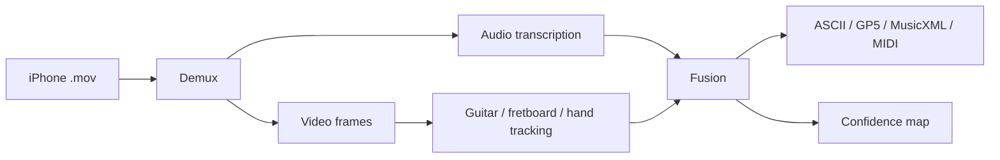

# TabVision Architecture Brief

TabVision turns a single iPhone video of guitar playing into tablature. Audio
identifies when notes occur and what pitch they have; video constrains where
the fretting hand is on the neck; fusion chooses the playable string/fret path.

Current demo status: scaffold only. Replace this with measured eval numbers
and screenshots after the integrated branch passes the Phase 8/9 gates.
