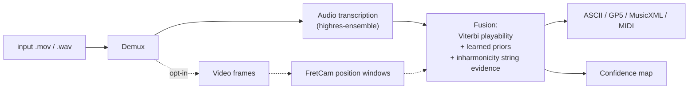

# TabVision Architecture Brief

TabVision turns a recording of solo guitar into tablature. Audio identifies
when notes occur and what pitch they have; **fusion** decides the string and
fret — which is the actual problem, since one pitch is playable in five or six
places. Video position evidence exists and is wired in, but it is opt-in: it
measured ~0 end-to-end and does not run by default.

```mermaid
flowchart LR
    A["input .mov / .wav"] --> B["Demux"]
    B --> C["Audio transcription<br/>(highres-ensemble)"]
    B -.opt-in.-> D["Video frames"]
    D -.-> E["FretCam position windows"]
    C --> F["Fusion:<br/>Viterbi playability<br/>+ learned priors<br/>+ inharmonicity string evidence"]
    E -.-> F
    F --> G["ASCII / GP5 / MusicXML / MIDI"]
    F --> H["Confidence map"]
```

Strict dataclass contracts between stages (SPEC §8) keep the stages
independent — the largest accuracy change in the project's history, the
inharmonicity channel, was added without altering one of them.

**Where the accuracy lives.** Onset and pitch are largely solved (0.927 / 0.909
across development players); string assignment is not, and every Tab F1 point
since v1.0.0 has come from fusion rather than better note detection. Current
default on GuitarSet under leave-one-player-out priors: **0.6609** aggregate on
the sealed player (single-line 0.6686, strummed 0.6533), **0.6801** across the
five development players. The physics channel is worth **+0.05 to +0.07**
aggregate, varying about twofold by player. Full run:
[`../EVAL_REPORTS/phase0_rotation_baseline_2026-07-25.md`](../EVAL_REPORTS/phase0_rotation_baseline_2026-07-25.md).

Scope: acoustic guitar. Electric is v2 (measured 0.12 Tab F1 on an
acoustic-trained backbone). The project is personal and non-commercial; some
default-path priors inherit CC-BY-NC-SA (see `../../LICENSES.md`).
